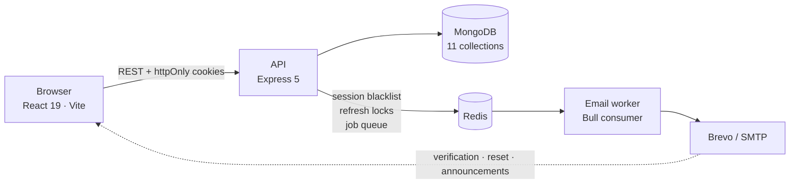
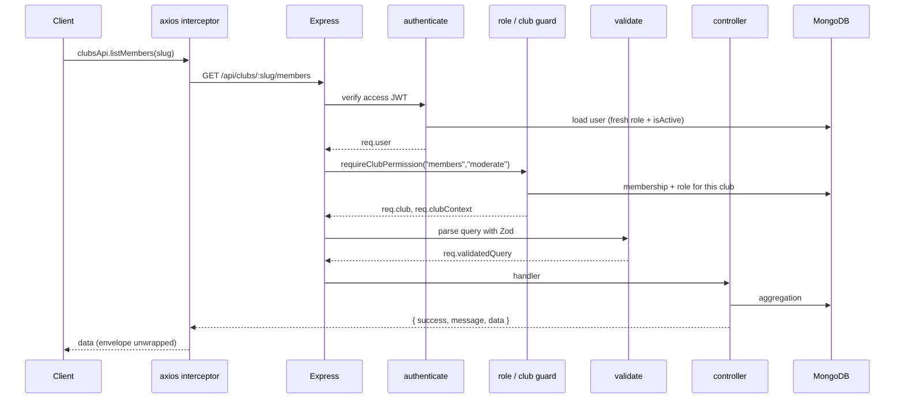
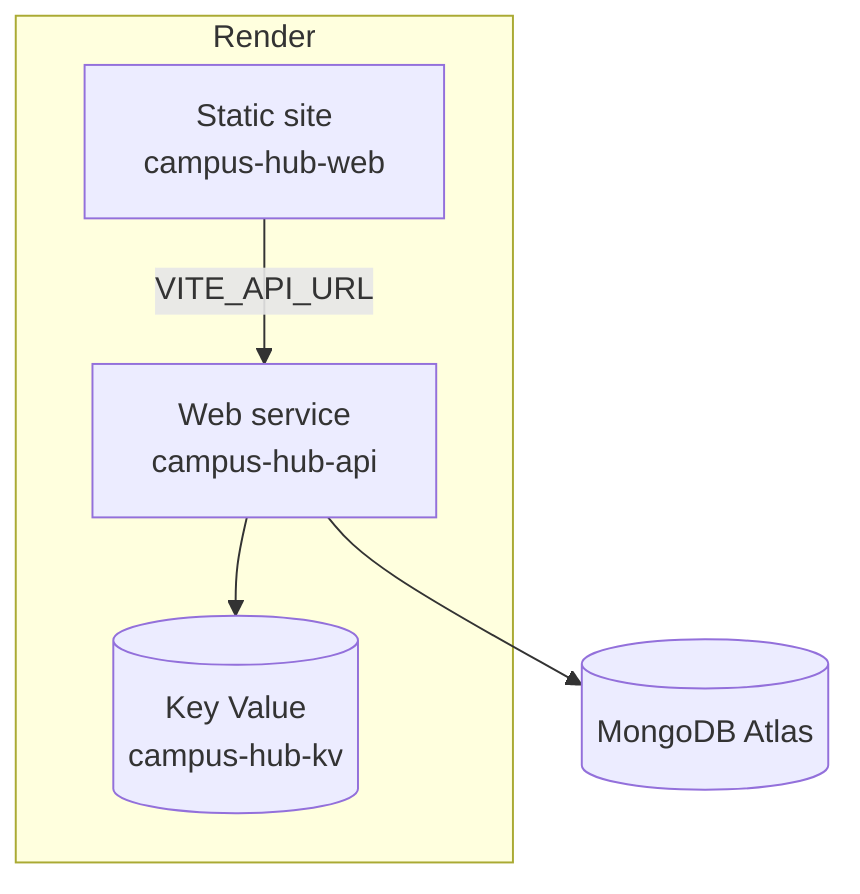

# Architecture

Two applications in one repository, talking over a REST API with cookie-based auth.



Redis does three unrelated jobs: it backs the Bull queue that sends email, it holds the
blacklist that kills an access token the moment its session is revoked, and it holds the
short-lived lock that makes concurrent refresh-token rotation safe.

---

## The request path

Every authenticated request walks the same chain. The middleware order matters — each stage
assumes the one before it has run.



**On a 401** the interceptor calls `/auth/refresh` once and retries the original request.
Concurrent 401s share a single in-flight refresh promise, so ten parallel requests produce one
rotation, not ten. Public auth endpoints are excluded — a failed login has no session to
refresh, and retrying would just double every wrong-password attempt.

---

## Backend layout

```
backend/src/
├── app.js              Express pipeline and route mounting
├── server.js           Boot: DB → Redis → queue → HTTP, plus graceful shutdown
├── config/             database, redis, queue, env
├── constants/          platform roles, club permission catalogue
├── controllers/        auth, accountSecurity, profile, clubs, events, announcements, admin
├── middlewares/        authenticate, requireRole, requireClubPermission, validate
├── models/             User (+ discriminators), Club, ClubRole, ClubMembership, Event, ...
├── routes/             one router per feature area
├── scripts/            db:init, db:reset and the seeds
├── services/           emailService
├── utils/              jwt, cookies, password, tokens, errors, responses
└── validators/         one Zod module per feature area
```

Each controller folder splits by concern rather than living in one file — `controllers/clubs/`
holds `clubs`, `members`, `roles` and a shared `helpers.js`. The helpers are where the
cross-cutting domain logic lives (`resolveClubContext`, `contextCan`, `assertCanGrant`,
`bumpClubStat`), so two controllers can never drift on the same rule.

### Serializers

Responses are shaped by explicit functions rather than returning documents. Each takes a `full`
or view flag so one function serves both a list row and a detail page:

| Function | Where | Views |
| --- | --- | --- |
| `publicEvent(e, { club, viewerStatus, full, can })` | `events/helpers.js` | list row · detail |
| `publicClubCard` / `compactClubRow` | `clubs/clubs.controller.js` | browse card · sidebar rail |
| `publicMemberRow(m, { includeEmail })` | `clubs/members.controller.js` | roster with / without email |
| `publicAnnouncement(a, { board })` | `announcements.controller.js` | digest · board (adds pinned) |
| `publicCard(u, { showEmail })` | `profile/publicProfile.controller.js` | stranger · self / admin |

This is what keeps a list endpoint from shipping a description-bearing document for every row,
and what keeps a stranger from seeing another student's email address.

---

## Frontend layout

```
frontend/src/
├── App.jsx             routes + provider tree
├── components/         EventCard, Pagination, TableFooter, StatCard, modals, layout/
├── contexts/           Auth, Toast, Confirm, ActiveClub
├── hooks/              useEventActions, useDebounced, useLatestRequest, useModalChrome
├── pages/              one per screen
├── services/api/       one module per feature area, over a shared axios client
└── utils/              events, clubs, text, nav, pagination
```

Three patterns recur and are worth knowing before reading a page:

- **`useLatestRequest`** guards against out-of-order responses. A page calls `startRequest()`
  when a fetch begins and checks `isCurrent()` before setting state, so a slow earlier response
  cannot overwrite a newer filter's results.
- **The loaded-key pattern.** Each list keeps `loadedKey` alongside the current filter key;
  `loadedKey !== key` means "refetching", which dims the list rather than blanking it.
- **`useEventActions`** owns every action an event card offers — register, leave, edit, publish,
  cancel — so five different pages share one implementation and one busy state.

---

## Deployment



The two services reference each other by URL, which Render cannot inject at first deploy — so
`FRONTEND_URL` and `VITE_API_URL` are set by hand after the first build. `FRONTEND_URL` is the
CORS allow-list *and* the base of every link inside an email, so a trailing slash on it breaks
CORS for the whole SPA; `config/env.js` strips one defensively.

The Key Value store has no persistence on the free plan. A restart clears the revoked-token
blacklist and drops anything still queued for email — survivable for a demo, and the reason
nothing user-facing is stored there.
