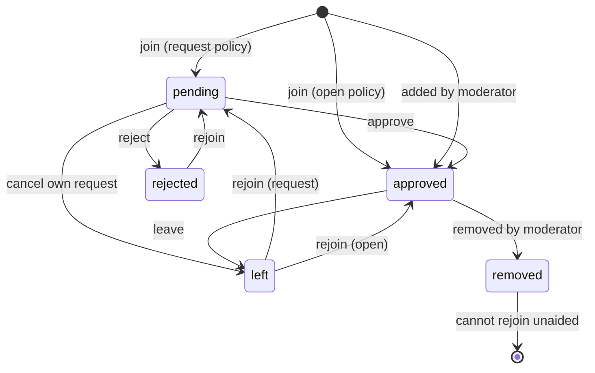
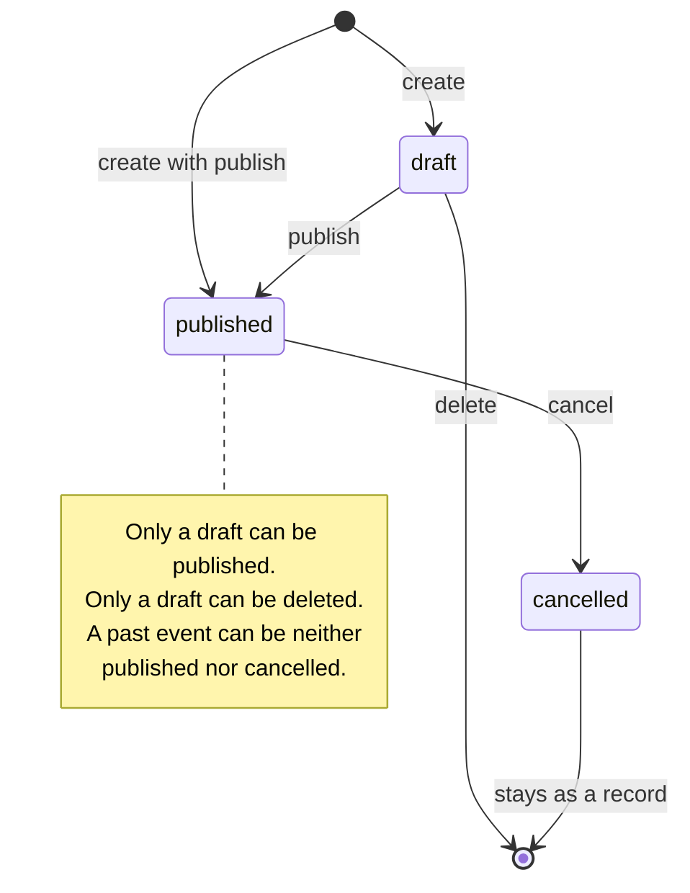
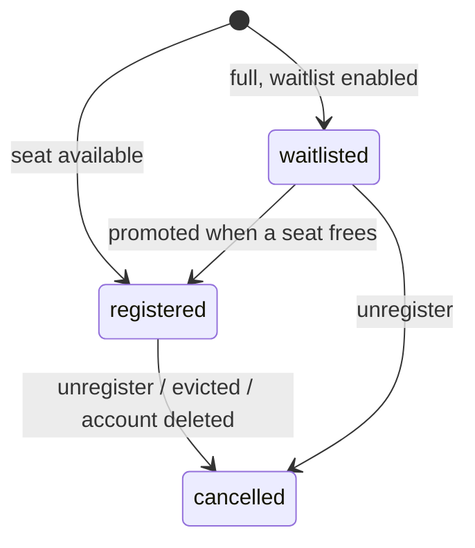
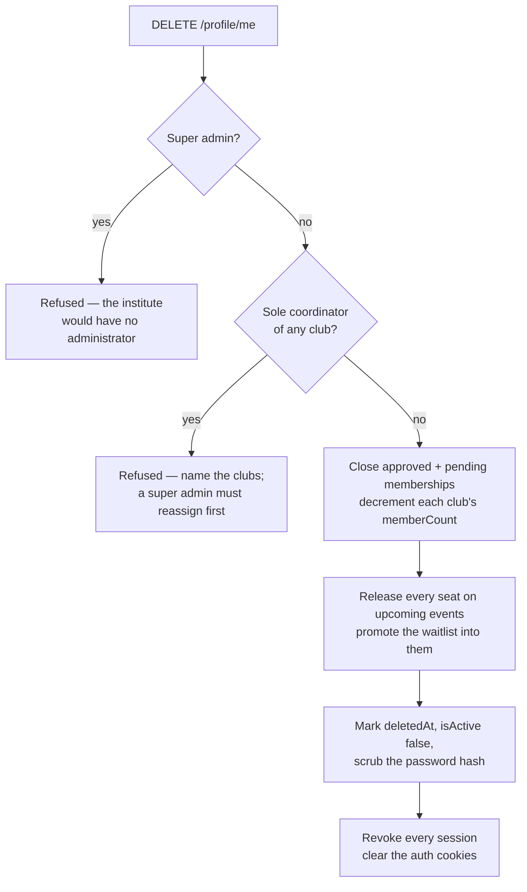

# Business logic

The domain rules the server enforces, the state machines behind them, and the invariants that
must hold. The frontend mirrors these rules to decide what to *show*; the server is what decides
what is *allowed*.

---

## Who is who

Three platform roles, stored as Mongoose discriminators so each gets its own profile shape.

| Role | Created by | Can |
| --- | --- | --- |
| `student` | Self-signup | Join and follow clubs, register for events, hold per-club roles |
| `faculty` | A super admin, with generated credentials emailed to them | Coordinate clubs; never joins as a plain member and never registers for events |
| `superAdmin` | Seeded by `db:init` from env vars — no signup path exists | Everything, institute-wide |

Two consequences fall out of this and are enforced everywhere:

- **Only students join clubs and register for events.** Faculty run them.
- **A faculty is always a coordinator of their clubs, never a plain member.** They cannot be
  demoted to member — the only way out is removal from the club.

---

## Club membership



**Join policy** is a per-club setting: `open` admits instantly, `request` creates a pending row,
`invite-only` refuses outright — a moderator must add you.

**`removed` is the one terminal state.** Someone who *left* may rejoin freely; someone an admin
*removed* cannot, and must be re-added by a moderator. That asymmetry is the point of having two
statuses that otherwise look alike.

**Rejoining reuses the row.** There is one membership document per (user, club) pair, enforced
by a unique index — rejoining clears `leftAt` and `removedBy` rather than inserting a second row,
so the history stays a single record.

### Invariant: `stats.memberCount` equals the approved rows

Every path that changes membership moves the counter exactly once, and does so by counting off
the **atomic prior state** rather than reading first and writing after:

```js
const prev = await ClubMembership.findOneAndUpdate(
   { userId, clubId, status: { $in: ["approved", "pending"] }, roleId: { $ne: coordinatorRoleId } },
   { status: "removed", leftAt: new Date(), removedBy: req.user._id },
   { returnDocument: "before" },
);
if (!prev) throw new NotFoundError("No active membership");
if (prev.status === "approved") await bumpClubStat(club._id, "memberCount", -1);
```

Two simultaneous removals both attempt the update; only one matches an active row, so only one
decrements. A read-then-write would let both see `approved` and decrement twice.

---

## Events



**Cancelling keeps the event and its registrations, deliberately.** The roster is the record of
who had signed up, and members need to see it was called off rather than have it vanish.
Everyone holding a seat is emailed. Deleting is reserved for drafts, which nobody has seen.

**Visibility** is `public` or `private` (members-only). Only a **verified** club may publish a
public event — an unverified club can run private events for its own members until a super admin
verifies it.

**Turning a published event members-only evicts the outsiders.** Anyone registered who is not a
member has their registration cancelled and is emailed, and the seats they free go to the
waitlist. The same rule runs in reverse: leaving a club, or being removed from one, releases
your seats at that club's members-only events.

---

## Seats and the waitlist



`capacity: 0` means unlimited. When a confirmed seat is given up, the **longest-waiting** person
is promoted — ordered by `registeredAt`, so the queue is genuinely first-come.

### Invariant: `stats.registered` never exceeds capacity

Claiming a seat is a single conditional write, not a read followed by a write:

```js
const seated = await Event.findOneAndUpdate(
   { _id: event._id, status: "published",
     $or: [{ capacity: 0 }, { $expr: { $lt: ["$stats.registered", "$capacity"] } }] },
   { $inc: { "stats.registered": 1 } },
   { returnDocument: "after" },
);
if (!seated && !event.waitlistEnabled) throw new ConflictError("This event is full");
```

Two people racing for the last seat both attempt the update; the condition only holds for one.
The loser goes to the waitlist, or is told the event is full.

**Promotion claims the seat first, too.** `promoteWaitlisted` increments the event counter
*before* flipping the waitlist row, and hands the seat back if nobody is waiting. Flipping the
row first and totalling the seats at the end would leave a window where a concurrent
registration reads the old count and takes a seat that promotion had already given away.

### Registration window

Registration is open while the event is `published` and now is before `registrationClosesAt` —
which is the explicit `registrationDeadline` when set, and `startAt` when not. A seat cannot be
given up once the event has started.

---

## Announcements

Two audiences, decided per notice:

| Visibility | Who can read it | Who is emailed |
| --- | --- | --- |
| `private` | The club's approved members | Members |
| `public` | Anyone signed in | Members + followers + (if attached to an event) its registrants |

Recipients are de-duplicated, so someone who is a member *and* a follower *and* registered gets
one email. The author never emails themselves. Deactivated and deleted accounts are excluded.

**Following is not membership.** A follow is a one-click subscription that only decides who gets
emailed about public notices; membership is what grants access to private material. Following a
club you have joined tells you nothing new, so the "Following" list excludes clubs you are in.

Emails are enqueued in **one bulk call**, not one round trip per recipient, and the enqueue is
wrapped so a queue failure can never fail the request — the announcement is already saved.

---

## Account deletion

Deletion is a **soft delete**, but it is not just a flag — leaving the rows behind would keep a
ghost on every roster and hold event seats forever.



Deactivating an account (`isActive: false`) is a different thing: it is **reversible**, so it
deliberately keeps memberships and seats. The person simply cannot sign in.

---

## Club lifecycle

`active` → `suspended` / `archived`, set by a super admin.

A non-active club is invisible: its events drop out of the feed, its detail pages 404 for
everyone but a super admin, and registration is refused. Because the events cannot be opened,
they are also excluded from *My Events*, the dashboard's "coming up" count and public profiles —
otherwise those lists would link to a page that 404s.

**A club must always keep at least one coordinator.** Removal enforces this by removing first and
then verifying, rolling itself back if it left none:

```js
const prev = await ClubMembership.findOneAndUpdate(/* flip to removed */);
const remaining = await ClubMembership.countDocuments({ clubId, status: "approved", roleId: coordinatorRoleId });
if (remaining === 0) {
   await ClubMembership.updateOne({ _id: prev._id }, { $set: { status: "approved", leftAt: null, removedBy: null } });
   throw new ConflictError("A club must keep at least one coordinator");
}
```

Counting first and then removing would race: two simultaneous removals could both see 2 and both
proceed. Remove-then-verify cannot drop the club to zero, because whichever removal leaves none
undoes itself — no transaction required.

---

## Where the rules are enforced

| Rule | Enforced in |
| --- | --- |
| Who may call an endpoint at all | `authenticate`, `requireRole` |
| Who may act inside a club | `requireClubPermission` → `resolveClubContext` → `contextCan` |
| What a payload may contain | Zod validators, `.strict()` so unknown keys are rejected |
| Domain transitions | The controller, before any write |
| Concurrency safety | Conditional `findOneAndUpdate`, never read-then-write |

The frontend duplicates these rules only to decide what to render. Every guard exists on the
server independently — hiding a button is never the protection.

## A known limitation

There are **no multi-document transactions**: local MongoDB runs standalone, where they are
unavailable. Multi-step operations are therefore sequences, ordered so that a crash mid-way
leaves the *safe* side of the inconsistency — a seat released but the counter not yet lowered
reads as fuller than it is, never emptier. Nothing repairs drift automatically; the counters are
all derivable from their rows, so a reconciliation pass would be straightforward to add if this
ever ran somewhere that mattered.
