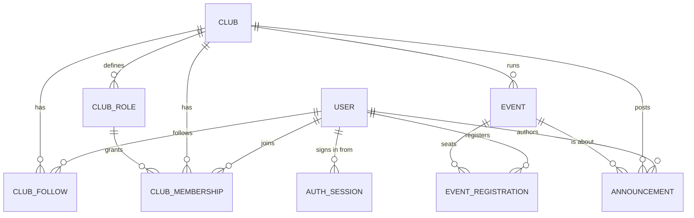

# Data model

Eleven collections. MongoDB has no foreign keys, so every relationship below is an ObjectId that
application code is responsible for keeping honest — cascades are explicit, in the controllers.

---

## Users, by discriminator

One `users` collection, three shapes. The `role` field is the discriminator key, so a write
through the wrong model silently drops the subtype's fields — controllers resolve the right one
via `modelFor(user)`.

| | Base | `student` adds | `faculty` adds |
| --- | --- | --- | --- |
| Identity | `email` `name` `username` `phone` | | |
| Auth | `passwordHash` `emailVerified` `isActive` `lastLoginAt` `deletedAt` | | |
| Profile | | `department` `year` `bio` `linkedinUrl` `githubUrl` `portfolioUrl` `tags` | `department` `designation` `officeLocation` `bio` `linkedinUrl` `portfolioUrl` `expertise` |
| Other | | `skills[]` `interests[]` | |

`superAdmin` adds nothing — base fields only.

`deletedAt` is the soft-delete marker. Deleted accounts are excluded from directories, profile
lookups, password reset and every email recipient list.

---

## Clubs and membership

**`clubs`** — `slug` (unique), `name`, `category`, `tagline`, `description`, `coverFrom`/`coverTo`,
`verified`, `foundedYear`, `status`, `settings.{joinPolicy,isPrivate}`, `socialLinks`, `tags`, and
the three denormalised counters below.

**`clubmemberships`** — the join table. One row per (user, club), enforced by a unique index;
rejoining reuses it. Carries `roleId`, `status`, `joinedAt`, `leftAt`, `removedBy`.

**`clubroles`** — per-club. `name`, `slug`, `color`, `permissions[]`, `roleWeight`, `isSystem`.
Every club gets `coordinator` (weight 100) and `member` (weight 0) on creation.

**`clubfollows`** — a bare (user, club) subscription, unique. Decides who is emailed about public
announcements, nothing more.

---

## Events

**`events`** — `clubId`, `title`, `description`, `eventType`, `startAt`, `endAt`,
`registrationDeadline`, `venue.{type,location,meetingUrl}`, `capacity`, `waitlistEnabled`,
`status`, `visibility`, `tags`, `stats.registered`.

**`eventregistrations`** — one row per (event, user), unique. `status`, `registeredAt`,
`cancelledAt`. `registeredAt` is what orders the waitlist queue.

**`announcements`** — `clubId`, `authorId`, `title`, `body`, `visibility`, `pinned`, and an
optional `eventId` linking it to an event.

---

## Auth collections

| Collection | Holds | Expiry |
| --- | --- | --- |
| `authsessions` | One row per signed-in device: hashed refresh token, `deviceInfo` (browser, OS, device, city/region/country from a bundled GeoIP db), `expiresAt`, `revokedAt` | TTL index on `expiresAt` |
| `emailverifications` | Hashed single-use token, `usedAt`, `revokedAt` | 24 hours |
| `passwordresets` | Hashed single-use token, `usedAt`, `revokedAt` | 30 minutes |

Tokens are never stored in the clear — only `sha256(token)`, so a database leak yields nothing
usable. Refresh tokens are opaque random strings; only the short-lived access JWT is signed.

---

## Denormalised counters

Three numbers are stored rather than counted, because they appear on every card in a list and
counting per row would mean an aggregation per request.

| Counter | Should equal | Moved by |
| --- | --- | --- |
| `Club.stats.memberCount` | approved memberships | join, approve, add, leave, remove, coordinator changes, account deletion |
| `Club.stats.followerCount` | follow rows | follow, unfollow |
| `Club.stats.eventCount` | events ever published | publishing (never decremented — it is a lifetime tally) |
| `Event.stats.registered` | registrations with status `registered` | register, unregister, promote, evict, capacity change |

Every one of these moves via a conditional `findOneAndUpdate` that counts off the atomic prior
state, so concurrent requests cannot double-count. See
[business-logic.md](business-logic.md) for the patterns.

Note that `eventCount` is a **lifetime tally**, not a current count — an event that was published
and later cancelled still counts. That is deliberate (it reads as club activity, and drives the
"most active" sort), but it means the number is not recomputable from current state alone.

---

## Indexes

Fourteen index sets, built by `npm run db:init`, which walks every model and calls `Model.init()`.

| Collection | Indexes |
| --- | --- |
| `users` | `email` (unique) · `username` (unique, sparse) · `{role, isActive}` · `createdAt` |
| `clubs` | `slug` (unique) · `{category, status}` · `{status, createdAt}` |
| `clubmemberships` | `{userId, clubId}` (unique) · `{userId, status}` · `{clubId, roleId}` · `{clubId, status, joinedAt}` |
| `clubroles` | `{clubId, slug}` (unique) · `{clubId, roleWeight}` |
| `clubfollows` | `{userId, clubId}` (unique) · `clubId` |
| `events` | `{clubId, startAt}` · `{eventType, status, startAt}` · `{status, startAt}` · `{visibility, status, startAt}` |
| `eventregistrations` | `{eventId, userId}` (unique) · `{userId, status}` · `{eventId, status, registeredAt}` |
| `announcements` | `{clubId, pinned, createdAt}` · `createdAt` · `{eventId, pinned, createdAt}` |
| `authsessions` | `refreshTokenHash` (unique) · `expiresAt` (TTL) · `{userId, expiresAt}` |
| `emailverifications`, `passwordresets` | `userId` · `tokenHash` · `expiresAt` (TTL) |

`db:init` only ever **creates** missing indexes — it never drops. Removing an index from a schema
therefore requires either dropping it by hand or starting from a fresh database (`db:reset` drops
the whole database first).

---

## Cascades

Deletion is explicit application code. What each one clears:

| Deleting | Cascades to |
| --- | --- |
| **Club** (super admin) | memberships, follows, roles, announcements, its events' registrations, its events — then the club |
| **Event draft** | its registrations, then the event. Only drafts can be deleted |
| **Account** (soft) | closes approved/pending memberships and decrements each club's count; releases every seat on upcoming events and promotes the waitlist into them; revokes sessions |
| **Custom role** | refused while any live member holds it; past members are remapped to `member` first, so approving one later cannot resurrect a dangling `roleId` |

Cancelling an event is **not** a deletion: the event and its registrations stay as the record.
