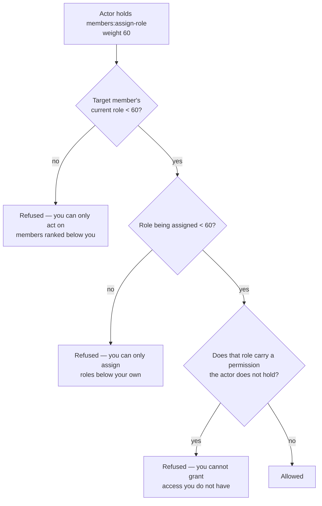
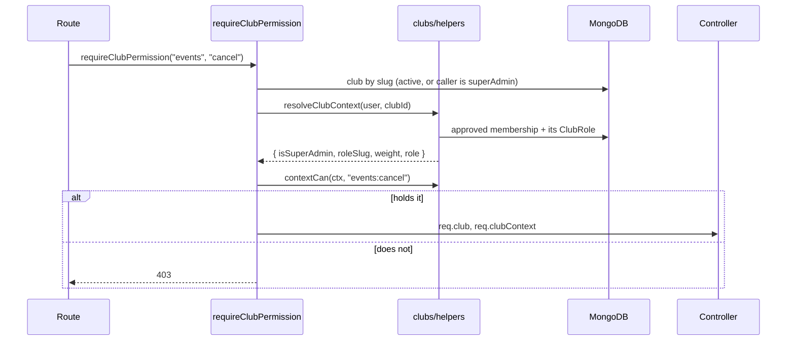

# Roles and permissions

Two independent layers. Platform roles decide which *areas* of the product you reach; per-club
roles decide what you may do *inside one club*.

---

## Platform roles

| Role | Scope |
| --- | --- |
| `student` | Joins clubs, registers for events, may hold a per-club role |
| `faculty` | Coordinates clubs; sees only the clubs they coordinate |
| `superAdmin` | Institute-wide; implicitly holds every club permission in every club |

Checked by `requireRole` on the routes where the whole area is role-gated — the admin
directories, club creation, coordinator assignment.

---

## Per-club roles

Every club gets two **system roles** on creation, and may define any number of custom ones.

| Role | Weight | Notes |
| --- | --- | --- |
| `coordinator` | 100 | System. Implicitly holds every permission. Only a super admin assigns or removes it, and a club must always keep one. |
| *custom roles* | 1–99 | Any subset of the catalogue below |
| `member` | 0 | System. The default on join; no permissions. |

System roles cannot be renamed, reweighted or deleted.

### The permission catalogue

| Key | Grants |
| --- | --- |
| `club:edit` | Name, logo, description, tags, join policy |
| `members:moderate` | Approve, reject and remove members; see member stats |
| `members:assign-role` | Assign roles to members |
| `roles:manage` | Create, edit and delete custom roles |
| `announcements:create` | Post announcements |
| `announcements:pin` | Pin announcements to the top of the board |
| `announcements:delete` | Delete anyone's announcement |
| `events:create` | Run the event creation wizard |
| `events:edit` | Edit details, reschedule, view the attendee roster |
| `events:publish` | Take a draft live |
| `events:cancel` | Call off a live event, delete a draft |

---

## Weight bounds authority

Weight is what stops delegation becoming escalation. Two rules apply to **every** action on a
role or a member, and both are checked on both ends:

The third check is the one that is easy to miss. Weight alone is not enough: a *lower-ranked*
role can still carry a permission the assigner lacks, which would make `members:assign-role` a
back door to every other permission. `assertCanGrant` applies the superset rule to both role
editing and member re-roling, from one shared helper so the two cannot drift.

A coordinator and a super admin skip these checks — they already hold everything.

---

## How a check runs

`contextCan` returns true when the caller is a super admin, when their role slug is
`coordinator`, or when the permission is in their role's list. The resolved context rides on the
request, so the handler never re-queries it.

One route resolves its permission from the request body rather than statically:
`PATCH /clubs/:slug/events/:eventId/status` needs `events:publish` or `events:cancel` depending
on which status is being set.

---

## What the frontend does with this

List endpoints return a `viewer` block, and event rows carry their own `canEdit` / `canPublish` /
`canCancel`, so a page can render the right controls without asking per row. A cross-club list
resolves the caller's context for the whole page in two queries via `resolveClubContexts`, rather
than one lookup per card.

This is presentation only. Every permission is checked again on the server for the write itself —
a hidden button is never the protection.
